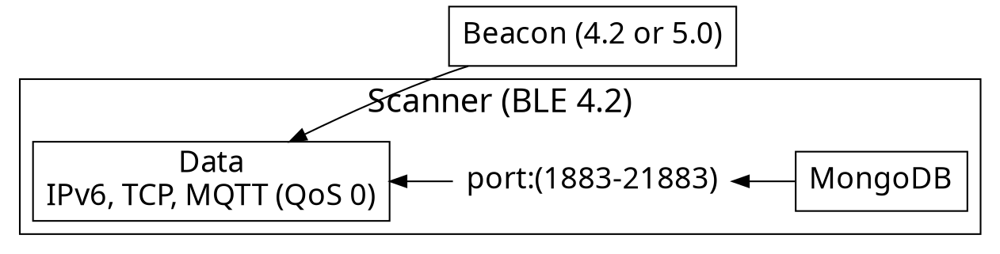

tags: IPS, BLE 5.0, Beacon, Scanner, MQTT, NodeRed, MongoDB, Trilateration, Kalman Filter, Embedded Systems


# Indoor Positioning System (IPS)

---

RSSI-based IPS should contain transmitters and receivers, known as beacon and scanner, respectively. This study uses the beacon-based configuration, with **beacons** placed in a **fixed position**, and the **scanner** acts as a **moving element**. 

---

## Project Main Folders

- Hardware
- databasewiring
- Software

---


### Usage flow

---



---
## Hardware (Beacon, Scanner)

- Mediatek (Linkit 7697)
- Arduino (Nano33)
- HC Tech (HC-42)
- Raspberry (Pi4)
  - Testing

---


## Algorithm Specs

- Signal propagation model
    - Linear regression
- Trilateration
- Modification coefficients (Random Walk)
- Kalman Filter

---
## Required libraries


### Arduino IDE

```c=
#include <Wire.h>
#include <LiquidCrystal_I2C.h>
// setup I2C address (LCD controller)
//     There are two different models of LCD, as follows:
//         0x3F (PCF8574A)
//         0x27 (PCF8574T)
```

```c=
//MQTT library
#include <PubSubClient.h>
```

---
### Python (to modify)

```typescript
// in background script
const fakeLogin = async () => true

channel.answer('isLogin', async () => {
  return await fakeLogin()
})
```

<br>

```typescript
// in inject script
const isLogin = await channel.callBackground('isLogin')
console.log(isLogin) //-> true
```

---

### Wrap up

- Cross envornment commnication
- A small library to solve messaging pain
- TypeScript Rocks :tada: 

---

### Thank you! :heart: 

You can find me on

- GitHub
- Twitter
- or email me
