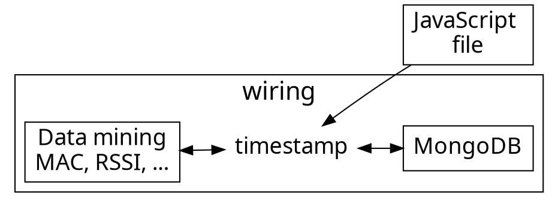

# Database wiring

<!-- Put the link to this slide here so people can follow -->

---

In this section, connectivity between **MQTT** and **MongoDB** is established.

In order to keep a clear record, we will add a **timestamp**, which will be combined with the data package from MongoDB, increasing the size of the JSON string.


---

### Usage flow

---



---

### Node-Red wiring

---


---

### timestamp.js

---

```js=
let currentDate = new Date().toLocaleString([], {timeZone: "Asia/Taipei", hourCycle: 'h23',  seconds: 'long'});
msg.payload = {object:msg.payload, value:currentDate}; 

return msg; 
```

---

## MongoDB ports (common error)

Please pay special attention to MongoDB port. It is common for MongoDB when it restart to **change its port**, therefore, what yesterday was the port 49153, today can be 49156.

This change of ports will generate a connection error, due to Node-Red is not able to establish contact with the database, because the new port is not into the records.

In case of change of ports, please add the new port in the *output node* **mongodb out**.


---

### Wrap up

- To keep a clear record, add a timestamp script to mark every data package.
- In case of connection error with database, please check if the port has changed in your own system.
- If the port has a different number, edit the output node of the database (mongodb) to recover the connection. 

---

### Thank you! :couch_and_lamp: 

You can find us on

- GitHub
- Twitter
- or email me
